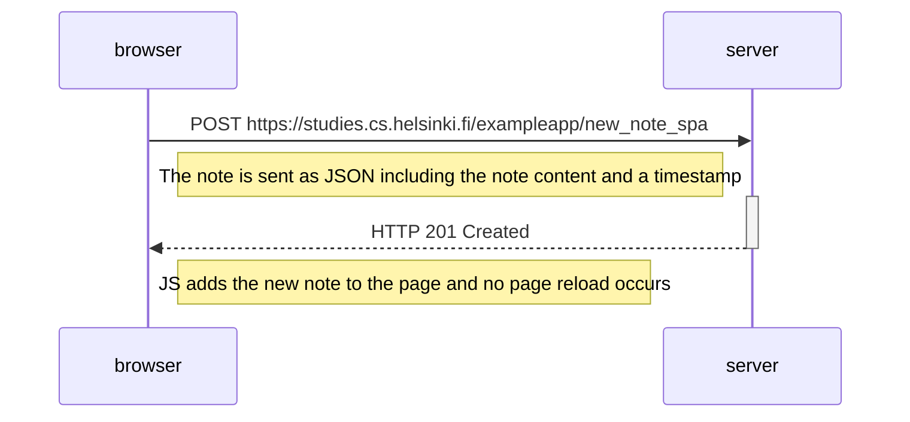

```mermaid
sequenceDiagram

    participant browser
    participant server

    browser->>server: POST https://studies.cs.helsinki.fi/exampleapp/new_note_spa
    Note right of browser: The note is sent as JSON including the note content and a timestamp

    activate server
    server-->>browser: HTTP 201 Created
    deactivate server

    Note right of browser: JS adds the new note to the page and no page reload occurs

   
```